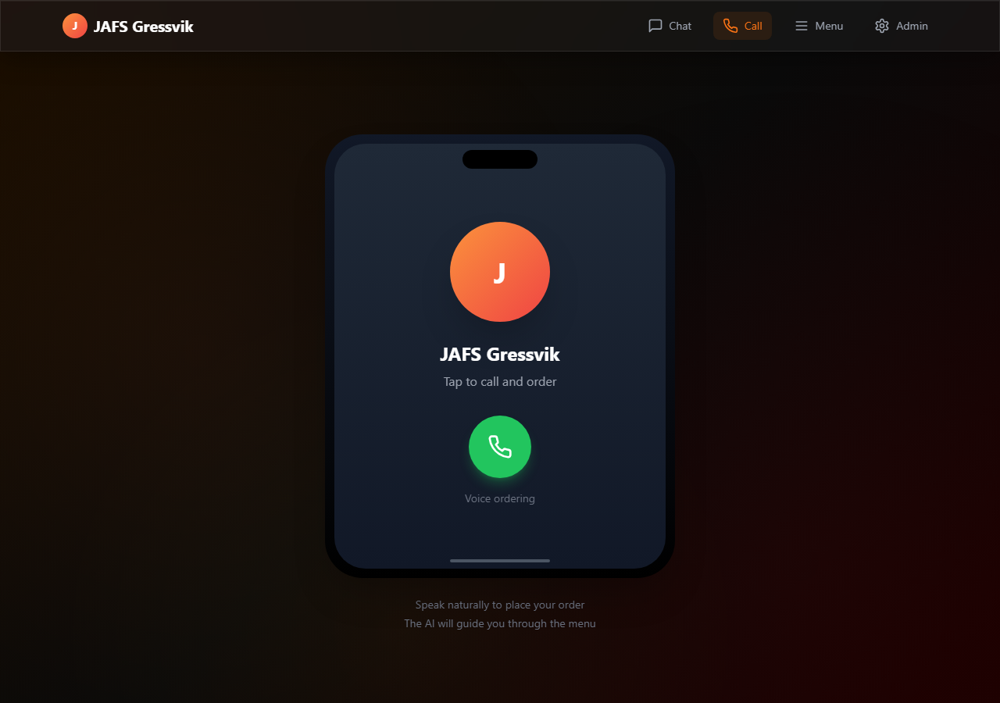

# Voice Ordering System for Restaurants

[](https://react.dev/)
[](https://vitejs.dev/)
[](https://nodejs.org/)
[](https://tailwindcss.com/)
[](https://github.com/marketplace/models)

An AI-powered restaurant ordering system with a phone-style voice interface, text chat ordering, searchable menu, printable receipt, and a simple kitchen dashboard for staff.

The demo is currently configured for JAFS Gressvik, but the menu, assistant prompt, branding, and restaurant details can be adapted for any restaurant, takeaway, cafe, or custom AI ordering agent.



## Highlights

| Area | What it includes |
| --- | --- |
| Customer ordering | Voice-call interface, text chat, quick actions, order summary |
| AI assistant | Menu understanding, follow-up questions, order confirmation, fallback responses |
| Restaurant menu | Searchable menu categories, prices, sizes, add-ons, opening hours |
| Staff dashboard | New, preparing, ready, and completed order stages |
| Receipts | Digital receipt modal with print support |
| Local demo | Runs without production infrastructure using in-memory storage |

## Main Screens

- `Chat` - text-based ordering with suggested actions and live order summary.
- `Call` - phone-style voice ordering using speech recognition and text-to-speech.
- `Menu` - searchable restaurant menu grouped by category.
- `Admin` - staff dashboard for tracking and updating order status.

## Tech Stack

| Layer | Tools |
| --- | --- |
| Frontend | React 18, Vite, Tailwind CSS, React Router, Lucide React |
| Voice | Web Speech API, ElevenLabs text-to-speech, browser speech fallback |
| Backend | Node.js, Express.js, GitHub Models, Azure AI Inference SDK |
| Storage | In-memory demo storage, optional MongoDB connection placeholder |

## Project Structure

```text
.
+-- backend/
|   +-- data/
|   |   +-- menu.js                  # Restaurant menu and helper functions
|   +-- routes/
|   |   +-- chat.js                  # AI conversation endpoints
|   |   +-- menu.js                  # Menu endpoints
|   |   +-- orders.js                # Order management endpoints
|   |   +-- transcripts.js           # Conversation transcript endpoints
|   +-- services/
|   |   +-- aiService.js             # AI prompt, fallback logic, session context
|   |   +-- orderService.js          # Order storage, status updates, receipts
|   +-- .env.example
|   +-- package.json
|   +-- server.js
+-- frontend/
|   +-- src/
|   |   +-- components/              # Receipt, order summary, chat UI pieces
|   |   +-- hooks/                   # Chat and voice hooks
|   |   +-- pages/                   # Chat, call, menu, admin pages
|   |   +-- utils/api.js             # API client helpers
|   |   +-- App.jsx
|   |   +-- index.css
|   |   +-- main.jsx
|   +-- .env.example
|   +-- package.json
|   +-- vite.config.js
+-- docs/
|   +-- call-module.png              # README screenshot
+-- INSTALL.bat                      # Windows dependency installer
+-- START.bat                        # Windows local startup helper
+-- QUICK-START-GUIDE.md             # Demo walkthrough
+-- PROJECT-SUMMARY.md               # Longer project notes
+-- README.md
```

## Getting Started

Requirements:

- Node.js 18 or newer
- npm
- Chrome or Edge for the best browser speech-recognition support

Install dependencies:

```bash
npm run install:all
```

Windows shortcut:

```bat
INSTALL.bat
```

## Environment Setup

Create `backend/.env` from `backend/.env.example`:

```env
GITHUB_TOKEN=your_github_models_token
GITHUB_AI_MODEL=gpt-4o-mini
PORT=3001
NODE_ENV=development
MONGODB_URI=
```

Create `frontend/.env.local` from `frontend/.env.example`:

```env
VITE_ELEVENLABS_API_KEY=your_elevenlabs_api_key
```

Notes:

- `GITHUB_TOKEN` enables the best AI conversation behavior.
- Without `GITHUB_TOKEN`, the backend uses local fallback responses.
- Without `VITE_ELEVENLABS_API_KEY`, the voice module falls back to browser speech synthesis.
- Real `.env` and `.env.local` files should stay private and are ignored by git.

## Run Locally

Start both apps together:

```bash
npm run dev
```

Or run them separately:

```bash
cd backend
npm start
```

```bash
cd frontend
npm run dev
```

Local URLs:

| Page | URL |
| --- | --- |
| Frontend | `http://localhost:5173` |
| Voice call module | `http://localhost:5173/call` |
| Menu | `http://localhost:5173/menu` |
| Admin dashboard | `http://localhost:5173/admin` |
| Backend health check | `http://localhost:3001/api/health` |

## Demo Flow

1. Open `http://localhost:5173/call`.
2. Click the phone button.
3. Say something like `I want a large pizza`.
4. Let the assistant ask for missing details.
5. Confirm the order.
6. Review the generated receipt.
7. Open `http://localhost:5173/admin` to move the order through preparation stages.

## API Overview

Chat:

```http
POST   /api/chat
POST   /api/chat/greeting
GET    /api/chat/:sessionId/transcript
DELETE /api/chat/:sessionId
```

Menu:

```http
GET /api/menu
GET /api/menu/categories
GET /api/menu/category/:categoryId
GET /api/menu/item/:itemId
GET /api/menu/search?q=pizza
GET /api/menu/items
GET /api/menu/info
```

Orders:

```http
POST   /api/orders
GET    /api/orders
GET    /api/orders/stats
GET    /api/orders/:orderId
GET    /api/orders/:orderId/receipt
PATCH  /api/orders/:orderId
PATCH  /api/orders/:orderId/status
DELETE /api/orders/:orderId
```

Transcripts:

```http
GET /api/transcripts
GET /api/transcripts/:sessionId
```

## Customization

To adapt this for another restaurant:

- Update `backend/data/menu.js` with categories, prices, hours, and restaurant details.
- Update `backend/services/aiService.js` for assistant name, language, tone, and ordering rules.
- Update `frontend/src/App.jsx` and page components for branding.
- Update `frontend/src/index.css` for the visual theme.

## Current Limitations

- Orders and transcripts use in-memory storage unless persistence is implemented.
- Voice recognition depends on browser support and microphone permissions.
- Some original menu text contains character-encoding artifacts that should be cleaned before production use.
- The current setup is optimized for local development, not hosted production.

## Contact

Need help with this project, a similar restaurant automation system, or a custom AI agent?

| Contact | Details |
| --- | --- |
| Phone / WhatsApp | `+92 309 5501847` |
| Email | `chumarhassan999@gmail.com` |
